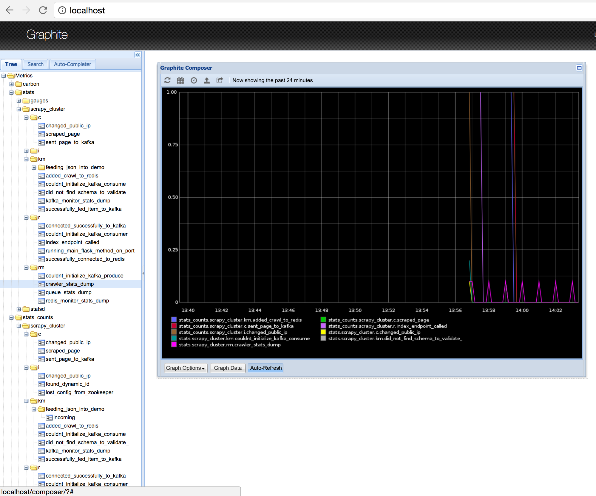
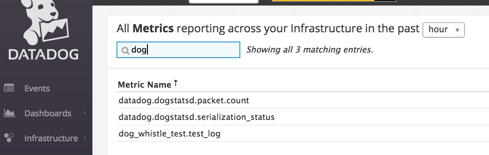
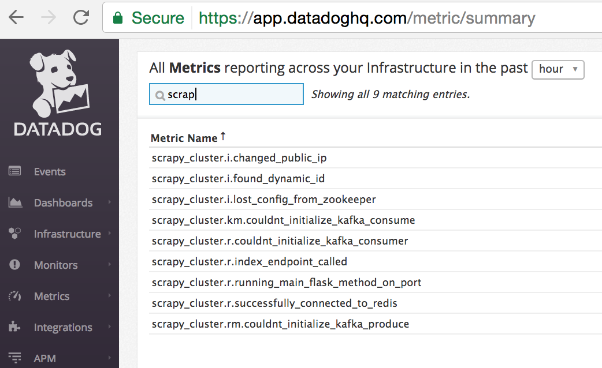

Usage
=====

This section outlines how to use the ``dog_whistle`` library in your project.

Analyze
-------

The first step you need to do is to download the ``dog_whistle`` library from pip.

::

    pip install dog-whistle -U

Navigate to the root directory of your project or code base, and run the following commands in the python shell:

::

    $ python
    >>> from dog_whistle import dw_analyze
    >>> dw_analyze('./')
    # it will spit out a bunch of text, like below:

    Valid Lines
    -----------
    ./crawling/distributed_scheduler.py
       111 : self.logger.error("Could not connect to Zookeeper")
       117 : self.logger.error("Could not ping Zookeeper")
       131 : self.logger.info("Zookeeper config changed", extra=loaded_config)
       189 : self.logger.info("Lost config from Zookeeper", extra=extras)
       303 : self.logger.error("Could not reach out to get public ip")
       381 : self.logger.info("Closing Spider", {'spiderid':self.spider.name})
       383 : self.logger.warning("Clearing crawl queues")

    Invalid Lines
    -------------

    <<<<<<<<<< YOU MUST FIX THESE BEFORE USING THE DOGWHISTLE LIBRARY >>>>>>>>>>>

    ./crawling/spiders/wandering_spider.py
       87 : self._logger.info("Did not find any more links" + str(value))

    Auto-Generated Template Settings
    --------------------------------

    dw_dict = {
        'name': '<my_project>',
        'tags': [
            # high level tags that everything in your app will have
            'item:descriptor'
        ],
        'metrics': {
            # By default, everything is a counter using the concatentated log string
            # the 'counters' key is NOT required, it is shown here for illustration
            'counters': [
                # datadog metrics that will use ++
                ("Could not connect to Zookeeper", "could_not_connect_to_zookeeper"),
                ("Could not ping Zookeeper", "could_not_ping_zookeeper"),
                ("Zookeeper config changed", "zookeeper_config_changed"),
                ("Lost config from Zookeeper", "lost_config_from_zookeeper"),
            ],
            # datadog metrics that have a predefined value like `51`
            # These metrics override any 'counter' with the same key,
            # and are shown here for illustration purposes only
            'gauges': [

                ("Zookeeper config changed", "zookeeper_config_changed", "<extras.key.path>"),
                ("Lost config from Zookeeper", "lost_config_from_zookeeper", "<extras.key.path>"),
            ]
        },
        'options': {
            # use statsd for local testing, see docs
            'statsd_host': 'localhost',
            'statsd_port': 8125,
            'local': True,
        },

    }

    Ensure the above dictionary is passed into `dw_config()`

    >>>

Lets break down each of these sections in more detail.

**Valid Lines**

This section outlines the valid logger lines that dog whistle has detected will work without issue. They should represent 'static' messages, and not include any variable substitution within the log message itself.

**Invalid Lines**

These lines were noted to have some kind of variable substitution inside them, and need to be corrected before being used by the dog whistle module. All variables *should* be enclosed in the ``extras`` dictionary anyways, and this helps standardize our logging practices.

.. warning:: You **must** correct these lines before using the dog whistle in production, otherwise our datadog metrics will not be consistent

Please note that the ``dw_analyze()`` method may not pick everything up, and it is important to test and look through your code to find any problematic lines. Multiline log states, or more complex logging may not be picked up.

**Auto-Generated Template Settings**

By analyzing only your valid lines, the dog whistle library dumps out a dictionary object that you will need to tweak and use later. At a bare minimum, it requires the following key:

* **name** - the name of your overall project

If you do not provide an ``options`` key, it is assumed you will be passing your ``DATADOG_API_KEY`` and ``DATADOG_APP_KEY`` via environment variables.

* **options** - the options to be passed to configure the statsd or datadog setup

For example:

::

    {
        'name': 'cool project',
        'options': {
            'statsd_host': 'localhost',
            'statsd_port': 8125,
            'local': True,
        }
    }

This configures all log messages to be counters, tied to the ``cool project`` namespace, and configured to use a local statsd host.

.. note:: If you have multiple modules or components to your project, you can use dot notation to namespace them like ``my_project.component1``

Further configuration can be refined via the ``metrics`` key, allow you to specify custom mappings of *log messages* to *keys*.

::

    'counters': [
        ("Could not connect to Zookeeper", "zookeeper.connection.error"),
        ("Could not ping Zookeeper", "zookeeper.connection.ping"),
        ("Zookeeper config changed", "zookeeper.config_changed"),
        ("Lost config from Zookeeper", "lost_config_from_zookeeper"),
    ],

Normally, the dog whistle sanitizes the log message into a lowercase/underscore form. However, we also provide the ability to custom map log messages to key naming conventions.

In the above example, we see a ``counters`` mapping being applied to three of the four log messages. Instead of using the default (shown on line 4), it will use the custom key.

The same can be said for gauges:

::

    'gauges': [
        ("Zookeeper config changed", "zookeeper_config_changed", "buried.key.here"),
        ("Lost config from Zookeeper", "zookeeper.connection.problem", "num_tries"),
    ]

The dog whistle library automatically detects ``extras`` being passed into the log method, and adds lines here to recommend you use a gauge incase you are tracking a particular value in question via your ``extras`` dictionary.

.. note:: At time of writing, dog whistle does not support multiple gauges for a single log statement

Here, we dig into the extras dictionary using dot notation to try to find the value we are looking for. If no value is found, it is not sent.

Lastly, ``tags`` are something that will always be included in your datadog stats. Here, you can specify a unique descriptor or other item to identify your process from the rest of the group. These tags are optional, but are helpful.

Local Configuration
-------------------

Setup
^^^^^

Now that you have an idea about your configuration, you need to integrate dog whistle into every python process or application you run. You will need to get the settings dictionary with your proper configuration into your application somehow. This guide does not cover the various ways of including the dictionary, however it is advised that you use either a settings file, environment variables, or some other way to avoid hard coding critical settings into your source code.

Once you have figured that out, at a **single** point within your application, add the following lines of code:

::

    from dog_whistle import dw_config, dw_callback
    settings = {} # your settings here
    dw_config(settings)

This will configue your dog whistle library to be ready to send metrics, the next step is to add a LogFactory ``callback`` like so:

::

    logger = LogFactory.get_instance() # your normal LogFactory setup can go here
    logger.register_callback('>=INFO', dw_callback)

.. note:: You will need ``scutils==1.2.0`` or above in order to use the callback feature in your project. Please update your requirements appropriately!

This will allow the dog whistle library to integrate and monitor every call the LogFactory logger creates. The callback system is much more advanced than what is decribed here, but this gives us the ability to monitor all log messages actually written by logger, anything ignored by the logger will also be ignored by this callback.

Testing
^^^^^^^

Let's test our configuration using a simple `statsd <https://github.com/etsy/statsd>`_ + `graphite <http://graphite.readthedocs.io/>`_ host. Here, we are going to use Docker to pull a container that allows us to view our new metrics to check naming conventions, typos, and other things.

If you are running your script locally, use the following:

::

    $ docker run -p 80:80 -p 2003-2004:2003-2004 -p 2023-2024:2023-2024 -p 8125:8125/udp -p 8126:8126 hopsoft/graphite-statsd

::

    'options': {
        # use statsd for local testing, see docs
        'statsd_host': 'localhost',
        'statsd_port': 8125,
        'local': True,
    }

If you are using Docker Compose, we recommend instead using the following settings:

::

  statsd:
    image: hopsoft/graphite-statsd
    ports:
      - "80:80"
      - "2003-2004:2003-2004"
      - "2023-2024:2023-2024"
      - "8125:8125/udp"
      - "8126:8126"

Then set the following in your ``options`` for your script:

::

    'options': {
        # use statsd for local testing, see docs
        'statsd_host': os.getenv('DATADOG_STATSD_HOST', 'statsd'),
        'statsd_port': int(os.getenv('DATADOG_STATSD_PORT', 8125)),
        'local': os.getenv('DATADOG_LOCAL', 'False') == 'True',
    },

and use an environment variable in your application:

::

    app1:
        image: example/cool-app:prod
        environment:
          - DATADOG_LOCAL=True

This will allow you to toggle your Datadog configuration on in local testing, but leaving it off will use production settings.

That's it! Run your application with a local setup, and your metrics will pump into the container running.

You can visit ``localhost:80`` to view your Graphite dashboard. On the ``Tree`` on the left hand side, navigate to ``Metrics/stats``. You should see your project name as a folder, and you can click on the individual metric to get it to show up in the graph.

.. note:: The graph comes by default with a 24hr view, click the "clock" icon on the graph to change it to minutes, otherwise you may not be able to see your data!

The same thing can be done under the ``Metrics/stats/gauges`` folder, you should see your project name and be able to click on any gauge metrics you would like.

If you are happy with your setup, this completes the local testing of the dog whistle integration into your project.

Datadog Configuration
---------------------

This section outlines how to test and connect DogWhistle to Datadog.

Local Datadog Agent
^^^^^^^^^^^^^^^^^^^

Here, we assume you have a local `Datadog Agent <http://docs.datadoghq.com/guides/basic_agent_usage/>`_ running on your local machine. Please refer to the official documentation for troubleshooting connecting your machine to Datadog.

.. note:: The majority of this guide should work on all platforms, however final Datadog + Docker integration may need to be conducted on a linux box only.

At this point you should have a Datadog Agent installed and running successfully on your machine. Refer to your datadog configuration file to get the location of the ``statsd`` host that Datadog is running. For example, on unix based systems the log location is:

::

    dogstatsd_log_file: /var/log/datadog/dogstatsd.log

This log is important to help debug any errors that may occur. One of the first problems you may encounter is that the agent may be shut down due to the following error.

::

    Traceback (most recent call last):
      File "/opt/datadog-agent/agent/dogstatsd.py", line 396, in run
        self.server.start()
      File "/opt/datadog-agent/agent/dogstatsd.py", line 327, in start
        self.socket.bind(self.address)
      File "/opt/datadog-agent/embedded/lib/python2.7/socket.py", line 228, in meth
        return getattr(self._sock,name)(*args)
    error: [Errno 48] Address already in use

This is caused by running both our Docker based Statsd container, and the Datadog Agent. Shut down the docker container and then restart the agent for it to boot up successfully.

If you are using Docker, the following extra configuration is required in your Datadog Agent conf file.

::

    # Required for Docker
    non_local_traffic: yes

The following python snippet allows us to test if DogWhistle and your Datadog Agent are working correctly

::

    # imports
    import logging
    from dog_whistle import dw_config, dw_callback
    from scutils.log_factory import LogFactory

    # show all application logs
    logging.basicConfig(format='%(levelname)s:%(message)s', level=logging.DEBUG)

    # our settings
    DW_SETTINGS = {
        'name': 'dog_whistle_test',
        'options': {
            'statsd_host': "localhost",
            'statsd_port': 8125,
            'local': True,
        },

    }

    # configure dog whistle and log factory
    dw_config(DW_SETTINGS)
    logger = LogFactory.get_instance()
    logger.register_callback('>=INFO', dw_callback)

    logger.info("test log")

While running this you should see a number of successful ``DEBUG`` or ``INFO`` level messages come through your console. Within a few minutes, visit the Datadog `Metrics Summary <https://app.datadoghq.com/metric/summary>`_ page, and you should see your new metric appear like so.

If your log messages begin to show up, you are now ready to enable DogWhistle locally to fully test your integration! For a more thorough test of DogWhistle, you can use the ``example.py`` script located within the base of this repo.

You will want to make sure your final application can hit the local Datadog Agent, if running as a normal process use

::

    'statsd_host': "localhost",

within your ``options``. If using Docker, set your configuration to

::

    environment:
      - DATADOG_LOCAL=True
      - DATADOG_STATSD_HOST=172.17.0.1 # linux only

to ensure your container can hit the local Datadog Agent.

.. warning:: At time of writing, Docker for Mac does not provide the ability for a container to reach the docker host. You should test your setup on a machine that has the ability to access the host so it can talk to the Datadog Agent running locally.

Once your application is configured, you can see the metrics in your `Metrics Summary <https://app.datadoghq.com/metric/summary>`_ like below, and begin building custom dashboards, graphs, and alerts based on your logging.

Direct API Configuration
^^^^^^^^^^^^^^^^^^^^^^^^

Direct Datadog API Configuration is planned for a future release.

Wrapping Up
-----------

Be sure to add the following to your projects requirements.txt!

::

    dog-whistle==X.X
    scutils==1.2.0

Where ``X.X`` is the current version of ``dog-whistle`` on pypi

.. note:: Version numbers are subject to change!